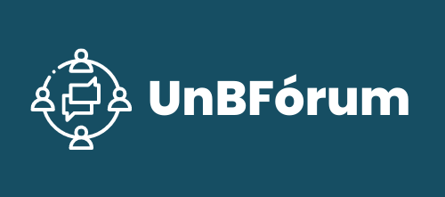

# UnBFórum

O UnBFórum é um fórum de discussão *online* cujo como objetivo é facilitar a busca e o compartilhamento de informações acadêmicas dentro da comunidade da Faculdade do Gama (FGA). 

Para atingir esse objetivo, a construção do fórum orientou-se por critérios qualitativos fundamentais para a elaboração de fóruns de discussão. Além disso, a aplicação utilizou a Teoria dos Grafos para estruturar a relação entre tópicos e categorias, por meio de um grafo bipartido.

## UnBForumBack

Este repositório consiste no desenvolvimento do backend do UnBFórum, utilizando a linguagem de programação Python e o framework FastAPI.

A documentação do backend está disponível em: https://unbforum-backend-4b05406a8bbf.herokuapp.com/docs ou https://unbforum-backend-4b05406a8bbf.herokuapp.com/redoc

## Como rodar a API

### Pré-Requisitos

Para executar o projeto, é necessário ter instalado em sua máquina as seguintes ferramentas:

- [Docker](https://docs.docker.com/get-docker/)
- [Docker Compose](https://docs.docker.com/compose/install/)

### Executando o projeto

1. Clone o repositório
```bash
git clone https://github.com/UnBForum/UnBForumBack.git
```

2. Entre na pasta do projeto
```bash
cd UnBForumBack
```

3. Execute o docker-compose
```bash
docker-compose -f docker-compose.yml up --build -d
```

4. Acesse o endereço http://localhost:8000/docs ou http://localhost:8000/redoc para visualizar a documentação da API

## Como rodar os testes

Para rodar os testes, execute o seguinte comando, estando dentro da pasta do projeto:
```bash
sh scripts/run_tests.sh
```

## Autores

|  |  |
|----------------------------------------------------------------|-------------------------------------------------------------------|
| Hérick Portugues                                               | Lucas Boaventura                                                  |

